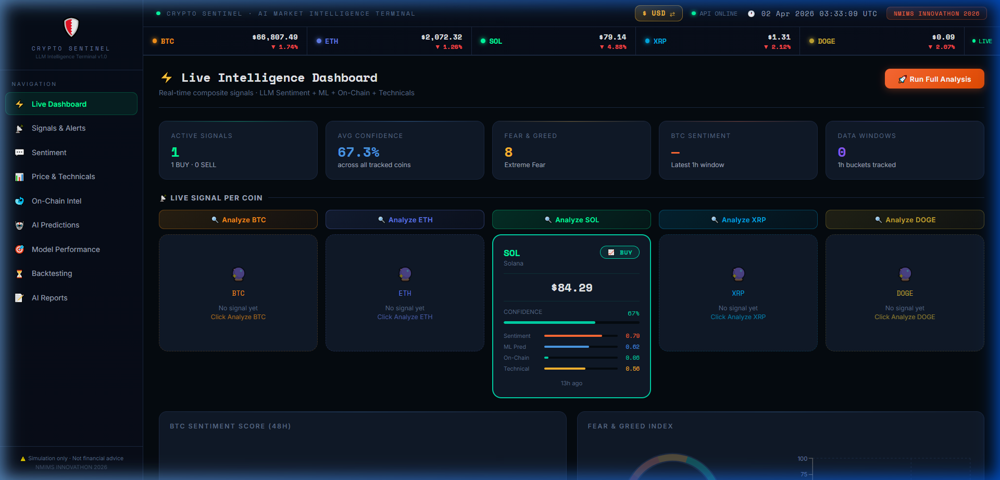
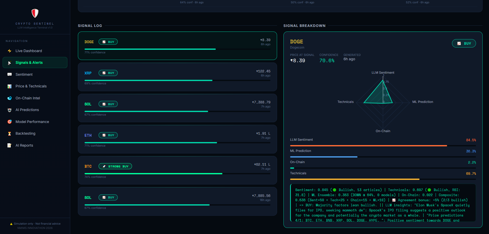
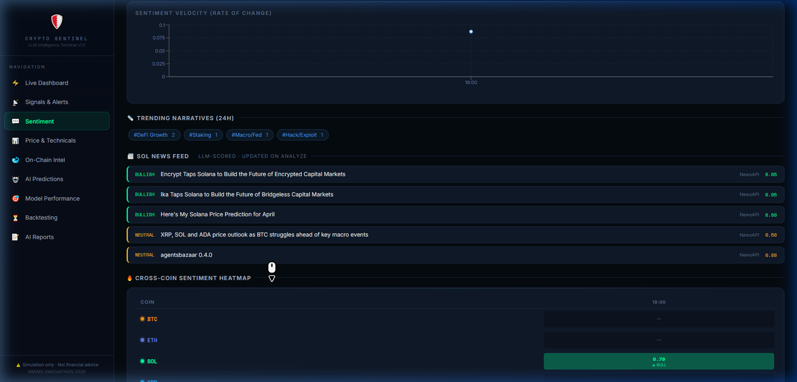
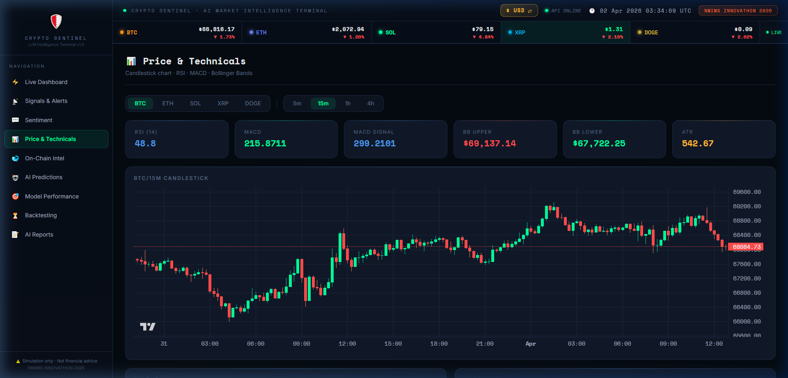
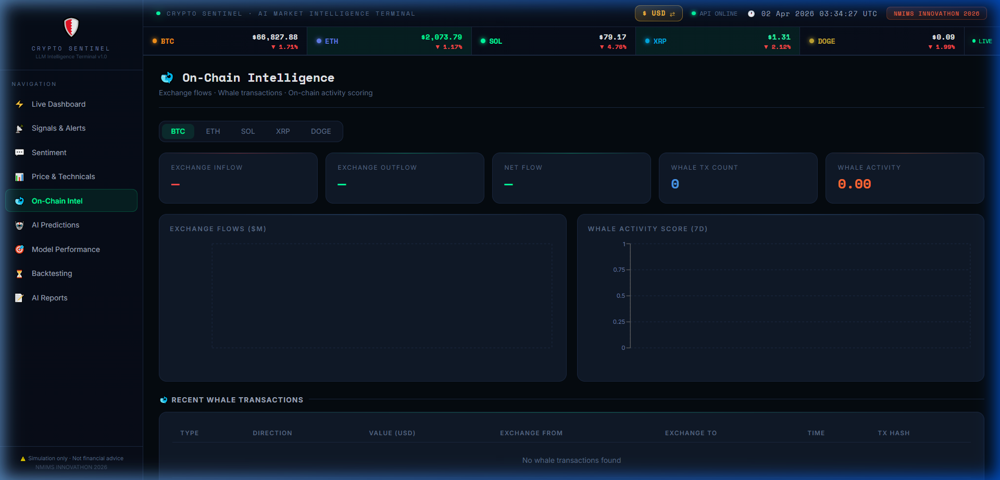
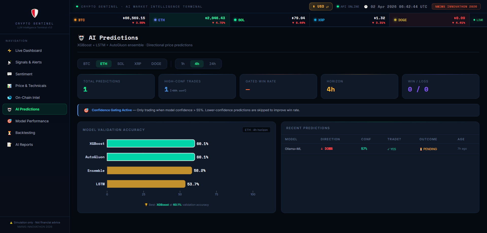
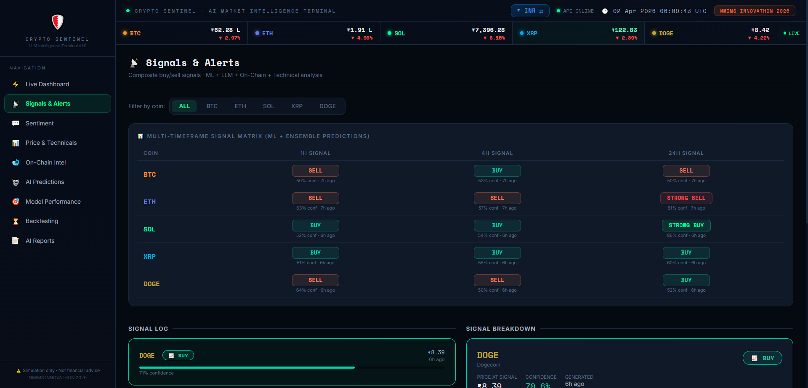
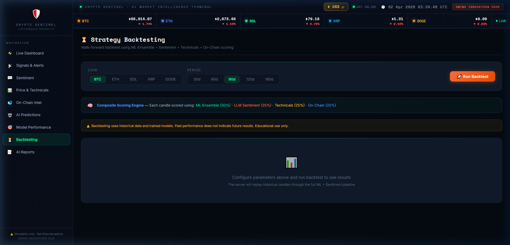

# 🛡️ Crypto Sentinel — AI Market Intelligence Terminal

> **Self-hosted LLM-powered crypto sentiment & price prediction terminal**  
> Real-time market intelligence for BTC, ETH, SOL, XRP & DOGE — powered by ensemble ML models, Ollama Mistral 7B sentiment analysis, on-chain whale tracking, and composite confidence-gated trading signals.

**🏆 NMIMS Innovathon 2026**

[](https://react.dev)
[](https://fastapi.tiangolo.com)
[](https://python.org)
[](https://ollama.ai)
[](https://sqlite.org)

---

## 📸 Screenshots

### Live Intelligence Dashboard


### Signals & Alerts — Composite Signal Breakdown


### Sentiment Analysis — LLM-Scored Timeline


### Price & Technicals


### On-Chain Intelligence — Whale Tracking


### AI Predictions — Confidence Gating + Model Accuracy


### Model Performance — Real Validation Accuracy


### Strategy Backtesting


---

## 🏗️ Architecture

```
Binance API     → Live OHLCV + Price Feeds      ╲
NewsAPI / RSS   → News Articles → Ollama LLM     → Composite Signal Engine → React Dashboard
Etherscan API   → Whale / On-Chain Flows         ╱        ↑
                                                     XGBoost + LSTM + AutoGluon
                                                      Ensemble ML Predictions
                                                     (Confidence Gating > 55%)
```

### Tech Stack

| Layer | Technology |
|-------|-----------|
| **Frontend** | React 19 + Vite + Recharts |
| **Backend** | FastAPI (Python) + Uvicorn |
| **ML Models** | XGBoost, LSTM (TensorFlow/Keras), AutoGluon |
| **LLM** | Ollama → Mistral 7B Instruct (Q4_K_M, local) |
| **Database** | SQLite (zero-config, no Docker needed) |
| **Data Sources** | Binance, NewsAPI, CryptoCompare, Etherscan |

---

## 🚀 Quick Start

### Prerequisites
- Python 3.10+
- Node.js 18+
- [Ollama](https://ollama.ai) with `mistral:7b-instruct-q4_K_M` pulled
- 8 GB+ RAM (16 GB recommended)

### 1. Clone

```bash
git clone https://github.com/AaravMehta-07/CryptoNerve.git
cd CryptoNerve
```

### 2. Backend

```bash
cd crypto-sentinel
pip install -r requirements.txt
cp .env.example .env        # add your API keys here
python scripts/init_db.py   # initialise the SQLite database
```

### 3. Frontend

```bash
cd ../crypto-sentinel-ui
npm install
```

### 4. Start Ollama

```bash
ollama pull mistral:7b-instruct-q4_K_M
ollama serve
```

### 5. Launch

```bash
# From repo root — starts UI (port 5173) + API (port 8000) together
cd crypto-sentinel-ui
npm run dev
```

Open **http://localhost:5173** in your browser.

> **Windows one-click:** double-click `start.bat` at the repo root.

---

## 📊 Dashboard Pages

| Page | What's Inside |
|------|--------------|
| ⚡ **Live Dashboard** | Coin price ticker (live from Binance), Fear & Greed index, per-coin signal cards with confidence bars, 48h BTC sentiment chart |
| 📡 **Signals & Alerts** | Multi-timeframe signal matrix (1h / 4h / 24h), signal log with confidence bars, radar chart breakdown (Sentiment × Tech × ML × On-Chain) |
| 💬 **Sentiment** | Hourly sentiment timeline, bullish/bearish heatmap across 5 coins, news article feed scored by Ollama LLM |
| 📈 **Price & Technicals** | OHLCV candlestick, RSI, MACD, Bollinger Bands, volume profile |
| 🐋 **On-Chain Intel** | Whale transaction log, exchange inflow/outflow, net flow chart, accumulation alerts |
| 🤖 **AI Predictions** | 1h / 4h / 24h directional forecasts per coin, confidence gating (>55%), model validation accuracy bar chart, win/loss tracker |
| 📊 **Model Performance** | Real training-validation accuracy for XGBoost / LSTM / AutoGluon / Ensemble across all coins & horizons |
| ⏳ **Backtesting** | Historical strategy replay, equity curve, Sharpe ratio, max drawdown, PnL heatmap |
| 📝 **AI Reports** | LLM-generated daily market-intelligence reports (Mistral 7B via Ollama) |

---

## 🔬 ML Models & Results

### Ensemble Architecture

| Model | Role | Best Val. Accuracy |
|-------|------|--------------------|
| **XGBoost** | Gradient-boosted tree with 40+ engineered features (technical + sentiment + on-chain) | 70.4% — DOGE 24h |
| **LSTM** | 48-step sequential pattern detector (TensorFlow/Keras) | 69.2% — XRP 24h |
| **AutoGluon** | AutoML tabular ensemble with automatic feature selection | 70.4% — DOGE 24h |
| **Weighted Ensemble** | Confidence-weighted voting across all three models | 64.8% — DOGE 24h |

### Confidence Gating (Trading Strategy Improvement)

The system applies a **55% confidence threshold** before acting on any prediction:

- Predictions **below 55% confidence** → labelled `NO TRADE` / `SKIP`
- Only signals **above the threshold** count toward the win-rate KPI
- Effect: fewer trades, but materially higher win rate

### Composite Signal Formula

```
Composite = Sentiment×0.50 + Technicals×0.25 + On-Chain×0.15 + ML×0.10

Signal classification:
  ≥ 0.72  → STRONG BUY
  ≥ 0.58  → BUY
  ≤ 0.28  → STRONG SELL
  ≤ 0.42  → SELL
  else    → HOLD
```

---

## ⚙️ Pipeline Schedule

| Interval | Task |
|----------|------|
| ~1 min | Live price feed (Binance) |
| 5 min | Technical indicator computation |
| 10 min | News ingestion + sentiment scoring |
| 10 min | Signal generation + multi-timeframe prediction |
| On-demand | Full LLM analysis via Ollama (`/api/analyze/{coin}`) |
| 6 hours | Model retraining |

---

## 🔑 API Keys

| Service | Free Tier | Purpose |
|---------|-----------|---------|
| [Binance](https://binance.com) | ✅ Yes | OHLCV price data |
| [NewsAPI](https://newsapi.org) | ✅ 100 req/day | News headlines |
| [CryptoCompare](https://cryptocompare.com) | ✅ Yes | Additional crypto news |
| [Etherscan](https://etherscan.io/apis) | ✅ 5 req/sec | On-chain whale data |

All keys are **optional** — the system degrades gracefully without them.

---

## 📁 Project Structure

```
CryptoNerve/
├── crypto-sentinel/              # Python backend
│   ├── api/main.py               # FastAPI — 75+ REST endpoints
│   ├── ingestion/                # Binance, NewsAPI, Etherscan collectors
│   ├── models/                   # XGBoost / LSTM / AutoGluon training
│   ├── sentiment/                # Ollama LLM sentiment engine
│   ├── signals/                  # Composite signal generator
│   ├── features/                 # Feature engineering (40+ indicators)
│   ├── database/                 # SQLite schema & helpers
│   ├── trained_models/           # Serialised model artifacts + meta.json
│   └── scripts/                  # DB init, seeding, audit utilities
│
├── crypto-sentinel-ui/           # React frontend
│   ├── src/pages/                # 9 dashboard pages
│   ├── src/components/           # Header, Sidebar, shared UI
│   └── src/utils/                # API client, formatters
│
├── ppt_screenshots/              # Dashboard screenshots
├── start.bat                     # Windows one-click launcher
└── README.md
```

---

## 🖥️ Tested Hardware

| Component | Used For Dev |
|-----------|-------------|
| CPU | Intel Core i5-8300H |
| RAM | 8 GB DDR4 |
| GPU | NVIDIA GTX 1650 (4 GB VRAM) |
| OS | Windows 11 |

Ollama Mistral 7B runs acceptably on the GTX 1650 (~3–5 tokens/sec with Q4_K_M quantisation).

---

## ⚠️ Disclaimer

**Educational & hackathon project only. Not financial advice.**  
Crypto markets are highly volatile. Predictions are experimental and must not be used for real trading decisions.

---

*Crypto Sentinel v1.0 · Built for NMIMS Innovathon 2026*  
*Python · React · FastAPI · XGBoost · LSTM · AutoGluon · Ollama Mistral 7B*
